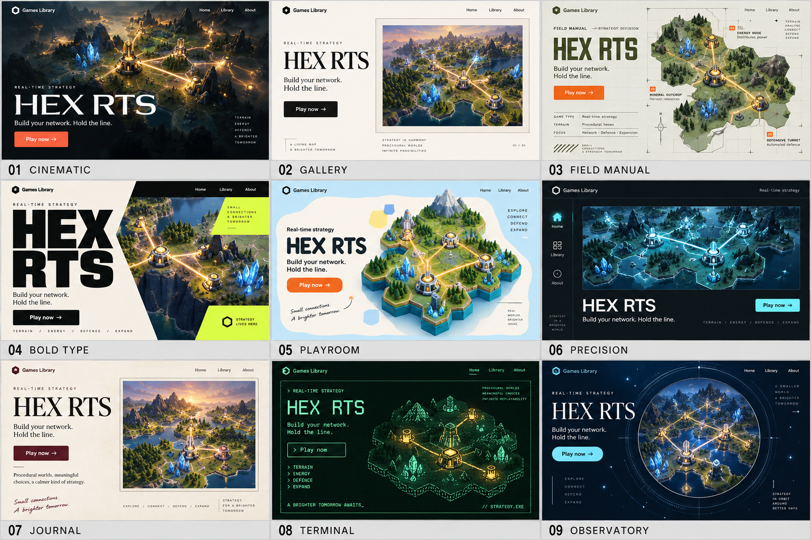
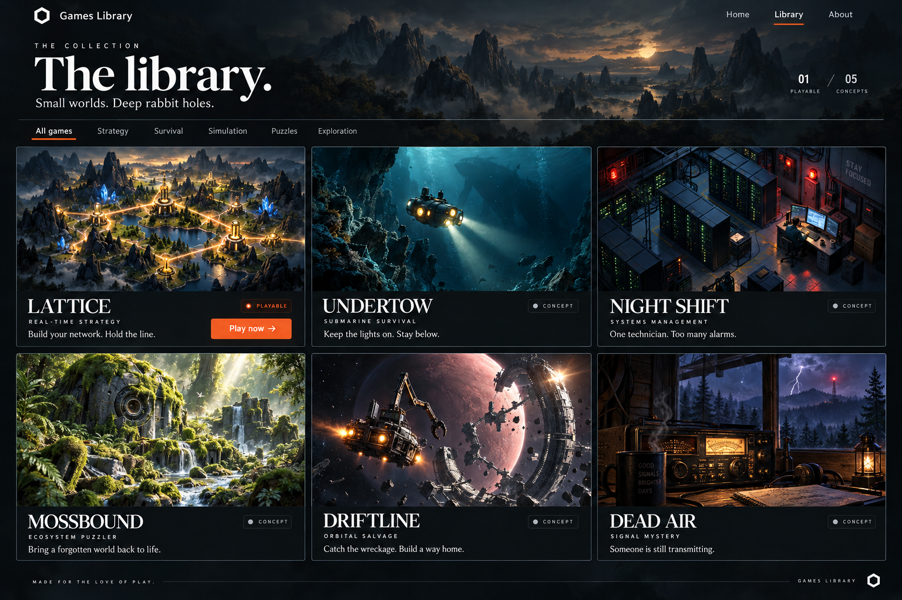

# Cinematic games library

## Approved direction — 4 October 2026

Teddy selected **01 — Cinematic** from the nine-direction exploration.
He then approved building the site and preserving both mockups and the game concepts.
He explicitly chose to show only Lattice on the initial public site.

## Visual language

- Use a dark charcoal canvas with cinematic game art.
- Let the game world occupy most of the home page.
- Use white display typography and quiet supporting text.
- Use warm orange for the primary play action.
- Keep navigation small, clear, and consistent.
- Let each future game have its own visual identity.
- Keep layouts spacious, with thin rules and restrained borders.
- Preserve contrast, keyboard focus, and reduced-motion support.
- Use responsive layouts rather than shrinking the desktop composition.

The home page uses large, light sans-serif lettering for Lattice.
The library and about pages use an editorial serif to soften the surrounding interface.
Inter and Cormorant Garamond are self-hosted through Fontsource.

## First release

The site contains a home page, a library, and an about page.
The catalogue has one playable game: **Lattice**.
Do not add empty cards, invented release dates, inactive filters, accounts, or fake activity.

The library uses one large illustrated entry with its description and direct play action.
The catalogue lives in `src/data/games.ts`. The game stays independently deployed.

## Future library exploration

This mockup demonstrates the direction with six games. Only Lattice exists today.
The other five are creative concepts, recorded in [Game concepts](GAME-CONCEPTS.md).
They are not part of the public catalogue or a release commitment.

## Artwork boundary

The artwork illustrates the mood and world of the game. It is not a gameplay screenshot.
The site identifies it as cover illustration.
The first exploration says Hex RTS; the accepted current name is Lattice.

The original PNGs remain unchanged. See [Artwork provenance](design/README.md) for their source and prompts.
